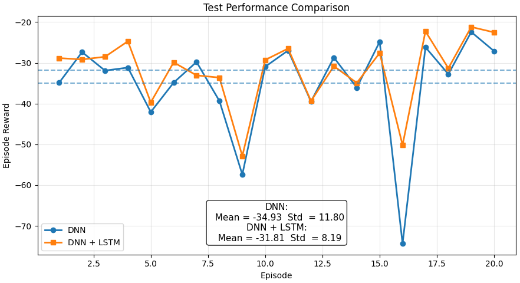

## 4WIS Robot Multi-Modal Trajectory Tracker

> Published in *2025 IEEE/RSJ International Conference on Intelligent Robots and Systems (IROS)*
> DOI: [10.1109/IROS60139.2025.11247526](https://ieeexplore.ieee.org/document/11247526)

---

### Basic Functions

* Implements a kinematic iterator and multi-modal trajectory generator for the 4WIS (Four-Wheel Independent Steering) robot, designed to construct reinforcement learning training environments

* Designs a DRL-based trajectory tracker with MPC-based lookahead structure for different motion modes

* Develops an autonomous motion mode decision-making mechanism based on target trajectory characteristics, enabling reasonable mode switching within the multi-modal motion space

<p align="center"></p>

> Demonstration of tracking performance under multiple motion modalities

|  |  |  |
| ----------------------------- | ----------------------------- | ----------------------------- |
| <div align="center" style="background-color: #f0f0f0;">Mode1: Ackermann Steering</div> | <div align="center" style="background-color: #f0f0f0;">Mode2: Lateral Steering</div> | <div align="center" style="background-color: #f0f0f0;">Mode3: Parallel Movement</div> |


---

### Prerequisites

> The versions of the dependent libraries are not strictly fixed; the following configuration is provided only as a reference for the author’s current experimental and development environment.

```
pip install gym==0.26.2
pip install matplotlib==3.10.8
pip install numpy==2.4.1
pip install stable_baselines3==2.6.0
pip install torch==2.7.0+cu128 --extra-index-url https://download.pytorch.org/whl/cu128
```
-----

### Code Description

* `utils/Trajectory_Generater.py`: Kinematic iterator and random reference trajectory generation module for the 4WIS robot
* `utils/Trajectory_Transfer.py`: Auxiliary utility functions used during trajectory generation and format conversion
* `env/mode1_env.py`: Trajectory tracker reinforcement learning environment for Ackermann steering
* `env/mode2_env.py`: Trajectory tracker reinforcement learning environment for lateral Ackermann steering
* `env/mode3_env.py`: Trajectory tracker reinforcement learning environment for parallel steering
* `Lower_update/Lower_update_guided_trainer.py`: DNN-DRL-based single-modal trajectory tracker training code
* `Lower_update/Lower_update_LSTM_trainer.py`: LSTM-DRL-based single-modal trajectory tracker training code
* `Lower_update/Lower_update_LSTM_tester.py`: LSTM-DRL-based single-modal trajectory tracker testing code

---

### Discussion and Notes

* The design of the state and action spaces draws on MPC-based lookahead optimization methods, ensuring that the tracker has foresight and can adjust the control strategy based on changes in the trajectory ahead
* In addition to the paper, we have added wheel angle and velocity calculation based on Ackermann steering principles, which helps reduce tire wear and improves execution efficiency
* We introduced a discount factor in the future distance error term, which aids in making the deceleration to stop smoother at the terminal
* Compared to pure DNN structures, the introduction of LSTM has led to improvements in trajectory tracking accuracy and stability. The quantitative comparison for the Ackermann mode is shown below

<p align="center"></p>

* It is important to note that the convergence difficulty of the LSTM structure increases significantly during training. Therefore, during actual training, a DNN tracker can be used as a prior or guiding model to improve stability and convergence speed in the early stages. Relevant implementation details can be found in `Lower_update/Lower_update_LSTM_trainer.py`
* The methods for mode decision-making can be categorized into three main approaches: the first is to allow network-based intelligent decision-making for early stopping; the second is to explore all possible modes to select, but it can only decide the next step without foresight; the third is that the given trajectory already includes mode information and deceleration process. ***In our future work, the trajectory planner will directly provide trajectories containing mode information, so the importance of the mode decision module will slightly decrease. The organization and open-source progress of this will be postponed for the time being***


---

### References

If this code repository is helpful to your research, please cite the following paper:

```bibtex
@INPROCEEDINGS{11247526,
  author={Bao, Runjiao and Xu, Yongkang and Zhang, Lin and Yuan, Haoyu and Si, Jinge and Wang, Shoukun and Niu, Tianwei},
  booktitle={2025 IEEE/RSJ International Conference on Intelligent Robots and Systems (IROS)},
  title={Deep Reinforcement Learning-Based Trajectory Tracking Framework for 4WS Robots Considering Switch of Steering Modes},
  year={2025},
  pages={3792--3799},
  doi={10.1109/IROS60139.2025.11247526}
}
```

<details>
<summary>点击查看中文版</summary>

## 4WIS 机器人多模态轨迹跟踪器

> 发表于 *2025 IEEE/RSJ International Conference on Intelligent Robots and Systems (IROS)*
> DOI：[10.1109/IROS60139.2025.11247526](https://ieeexplore.ieee.org/document/11247526)

---

### 基本功能

* 实现了面向 4WIS（四轮独立转向）机器人的运动学迭代器与多模态轨迹生成器，用于构建强化学习训练环境
* 为不同的运动模态设计了基于 MPC 前视结构的 DRL（深度强化学习）轨迹跟踪器
* 构建了一个基于目标轨迹特性的自主运动模态决策机制，能够在多模态运动空间中合理切换

<p align="center"></p>

> 多运动模态下跟踪效果演示

|  |  |  |
| ----------------------------- | ----------------------------- | ----------------------------- |
| <div align="center" style="background-color: #f0f0f0;">Mode1: 阿克曼转向</div> | <div align="center" style="background-color: #f0f0f0;">Mode2: 横向转向</div> | <div align="center" style="background-color: #f0f0f0;">Mode3: 平行移动</div> |


---

### 基本前置

> 各依赖库版本并非严格绑定，以下仅为作者当前的实验与开发环境配置参考

```
pip install gym==0.26.2
pip install matplotlib==3.10.8
pip install numpy==2.4.1
pip install stable_baselines3==2.6.0
pip install torch==2.7.0+cu128 --extra-index-url https://download.pytorch.org/whl/cu128
```

---

### 代码描述

* `utils/Trajectory_Generater.py`: 4WIS 机器人运动学迭代器与随机参考轨迹生成模块

* `utils/Trajectory_Transfer.py`: 轨迹生成与格式转换过程中使用的辅助工具函数

* `env/mode1_env.py`: 对应阿克曼转向的轨迹跟踪器强化学习环境

* `env/mode2_env.py`: 对应横向转向的轨迹跟踪器强化学习环境

* `env/mode3_env.py`: 对应平行移动的轨迹跟踪器强化学习环境

* `Lower_update/Lower_update_guided_trainer.py`: 基于 DNN-DRL 的单模态轨迹跟踪器训练代码

* `Lower_update/Lower_update_LSTM_trainer.py`: 基于 LSTM-DRL 的单模态轨迹跟踪器训练代码

* `Lower_update/Lower_update_LSTM_tester.py`: 基于 LSTM-DRL 的单模态轨迹跟踪器测试代码

---

### 讨论与记录

* 状态空间与动作空间的设计借鉴了 MPC 前视优化的方法，确保跟踪器具备前瞻性，能够根据前方轨迹的变化提前调整控制策略

* 在论文基础上，我们增加了基于阿克曼转向原理的车轮转角与速度解算，能够减少机器人轮胎的磨损并提升执行效率

* 通过测试，我们在未来的距离误差项中引入了折扣因子，这有助于提升终端减速至停止过程的平滑性

* 与纯 DNN 结构相比，引入 LSTM 后，轨迹跟踪精度和稳定性有所提高。以下是阿克曼模态下的定量对比结果

<p align="center"></p>

* 需要注意的是，LSTM 结构在训练阶段的收敛难度较大。因此，在实际训练过程中，可以采用 DNN 跟踪器作为先验或指导模型，以提升训练初期的稳定性和收敛速度。相关实现细节可参考 `Lower_update/Lower_update_LSTM_trainer.py`

* 模态决策的方法主要有三种：一是通过网络智能决策，允许提前停车；二是遍历所有可能的模态进行选择，但只能决策下一步，无法保持前瞻性；三是给定的轨迹已经包含了模态信息和减速过程。***我们后续的工作中，轨迹规划器会直接给出包含模态信息的轨迹，因此模态决策模块的重要性将略微下降，相关整理和开源进度将暂时推迟***

---

### 相关引用

如果本代码仓库对您的研究工作有所帮助，请引用以下论文：

```bibtex
@INPROCEEDINGS{11247526,
  author={Bao, Runjiao and Xu, Yongkang and Zhang, Lin and Yuan, Haoyu and Si, Jinge and Wang, Shoukun and Niu, Tianwei},
  booktitle={2025 IEEE/RSJ International Conference on Intelligent Robots and Systems (IROS)},
  title={Deep Reinforcement Learning-Based Trajectory Tracking Framework for 4WS Robots Considering Switch of Steering Modes},
  year={2025},
  pages={3792--3799},
  doi={10.1109/IROS60139.2025.11247526}
}
```
</details>


